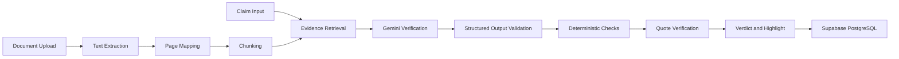

# Build a Production-Style Evidence Verification Workspace

You are a senior full-stack engineer, AI engineer, backend architect, and product designer.

Build a complete working application called:

# VeriTrace

The product verifies factual claims against uploaded financial and business documents.

It must identify whether a claim is:

* SUPPORTED
* CONTRADICTED
* NOT_FOUND
* NEEDS_REVIEW

The application must show:

* the exact source quote
* the source page
* highlighted evidence
* a concise explanation
* confidence information
* verification metrics
* review history

This is not a chatbot.

It is an enterprise-style document review and claim-verification workspace.

The final product should demonstrate:

* complete full-stack development
* PDF processing
* semantic retrieval
* LLM integration
* deterministic validation
* structured output
* evidence traceability
* backend architecture
* database persistence
* error handling
* testing
* evaluation
* public deployment

The application must work locally and must also be deployable without Docker.

---

# 1. Non-Negotiable Requirements

Follow these requirements exactly:

* Do not use Docker.
* Do not create a Dockerfile.
* Do not create docker-compose files.
* Do not require a paid OpenAI API.
* Use Google Gemini through a provider abstraction.
* Keep the LLM provider replaceable.
* Use deterministic validation alongside the LLM.
* Use React and TypeScript for the frontend.
* Use FastAPI and Python for the backend.
* Use Supabase PostgreSQL for the deployed database.
* Support SQLite locally.
* Deploy the frontend to Vercel.
* Deploy the backend to Render.
* Use secure temporary files for uploaded documents.
* Do not rely on permanent local filesystem storage in production.
* Use a minimal light visual design.
* Do not use a navy background.
* Do not use generic AI-dashboard styling.
* Do not use neon colors, excessive gradients, glass effects, or oversized cards.
* Do not copy VectorShift branding, logos, product names, or UI.
* Include an independent-project disclaimer.
* Build a complete application, not only a frontend prototype.

---

# 2. Product Purpose

The application helps analysts verify whether factual claims are supported by source documents.

Users should be able to:

1. Upload a PDF, TXT, or Markdown document.
2. Read the extracted document text.
3. Add a claim manually.
4. Extract multiple factual claims automatically.
5. Verify one claim.
6. Verify multiple claims.
7. See whether each claim is supported, contradicted, absent, or uncertain.
8. View the exact source evidence.
9. Navigate directly to the source page.
10. See the evidence highlighted.
11. Review confidence and diagnostic metrics.
12. View previous reviews.
13. Reopen and rerun previous verifications.
14. Load built-in sample scenarios.

The core message of the product is:

> Every conclusion should be traceable to exact source evidence.

---

# 3. Final Technology Stack

## Frontend

Use:

* React
* TypeScript
* Vite
* Tailwind CSS
* React Router
* TanStack Query
* Zustand
* Framer Motion
* Lucide React
* Zod for frontend validation

## Backend

Use:

* Python
* FastAPI
* Pydantic
* SQLAlchemy
* Alembic
* PyMuPDF
* scikit-learn
* RapidFuzz
* Gemini SDK or the official Google Gen AI SDK
* SQLite for local development
* PostgreSQL through Supabase for deployment

## Testing

Use:

* Pytest
* FastAPI TestClient or HTTPX
* Vitest
* React Testing Library

## Deployment

Use:

* Vercel for the frontend
* Render for the FastAPI backend
* Supabase PostgreSQL for persistent deployed data
* Optional Supabase Storage only if necessary later

Do not use Docker.

---

# 4. Final Deployment Architecture

The deployed architecture must be:

```text
User
  ↓
React frontend hosted on Vercel
  ↓
FastAPI backend hosted on Render
  ↓
Gemini API for semantic verification
  ↓
Supabase PostgreSQL for persistent data
```

Document handling:

```text
User uploads document
  ↓
Render backend creates a secure temporary file
  ↓
Backend extracts and processes document text
  ↓
Backend saves extracted text, pages, chunks, claims, and results
  ↓
Temporary original file is deleted
```

Do not depend on Render's local filesystem for permanent storage.

---

# 5. Project Structure

Create this project structure:

```text
evidence-review-workspace/
│
├── frontend/
│   ├── src/
│   │   ├── api/
│   │   │   ├── client.ts
│   │   │   ├── documents.ts
│   │   │   ├── claims.ts
│   │   │   ├── verification.ts
│   │   │   └── reviews.ts
│   │   │
│   │   ├── components/
│   │   │   ├── ui/
│   │   │   ├── layout/
│   │   │   ├── documents/
│   │   │   ├── claims/
│   │   │   ├── verification/
│   │   │   └── feedback/
│   │   │
│   │   ├── features/
│   │   │   ├── upload/
│   │   │   ├── document-viewer/
│   │   │   ├── claim-editor/
│   │   │   ├── verification/
│   │   │   └── history/
│   │   │
│   │   ├── hooks/
│   │   ├── layouts/
│   │   ├── pages/
│   │   ├── stores/
│   │   ├── types/
│   │   ├── utils/
│   │   ├── constants/
│   │   ├── App.tsx
│   │   ├── main.tsx
│   │   └── index.css
│   │
│   ├── public/
│   ├── package.json
│   ├── tsconfig.json
│   ├── vite.config.ts
│   └── vercel.json
│
├── backend/
│   ├── app/
│   │   ├── api/
│   │   │   ├── routes/
│   │   │   │   ├── health.py
│   │   │   │   ├── documents.py
│   │   │   │   ├── claims.py
│   │   │   │   ├── verification.py
│   │   │   │   └── reviews.py
│   │   │   └── dependencies.py
│   │   │
│   │   ├── core/
│   │   │   ├── config.py
│   │   │   ├── exceptions.py
│   │   │   ├── logging.py
│   │   │   └── security.py
│   │   │
│   │   ├── db/
│   │   │   ├── base.py
│   │   │   ├── session.py
│   │   │   └── migrations/
│   │   │
│   │   ├── models/
│   │   ├── schemas/
│   │   ├── repositories/
│   │   ├── services/
│   │   │   ├── document_service.py
│   │   │   ├── extraction_service.py
│   │   │   ├── chunking_service.py
│   │   │   ├── retrieval_service.py
│   │   │   ├── claim_extraction_service.py
│   │   │   ├── verification_service.py
│   │   │   ├── deterministic_validator.py
│   │   │   ├── evidence_locator.py
│   │   │   └── metrics_service.py
│   │   │
│   │   ├── llm/
│   │   │   ├── base.py
│   │   │   ├── gemini_provider.py
│   │   │   ├── mock_provider.py
│   │   │   ├── factory.py
│   │   │   └── prompts.py
│   │   │
│   │   ├── utils/
│   │   │   ├── numbers.py
│   │   │   ├── dates.py
│   │   │   ├── currencies.py
│   │   │   ├── percentages.py
│   │   │   ├── text.py
│   │   │   └── files.py
│   │   │
│   │   ├── evaluation/
│   │   ├── tests/
│   │   └── main.py
│   │
│   ├── alembic.ini
│   ├── requirements.txt
│   ├── render.yaml
│   └── start.sh
│
├── sample-data/
│   ├── financial-summary.txt
│   ├── supported-claims.json
│   ├── contradicted-claims.json
│   └── not-found-claims.json
│
├── docs/
│   ├── architecture.md
│   ├── api.md
│   ├── deployment.md
│   ├── evaluation.md
│   ├── product-decisions.md
│   └── security.md
│
├── .env.example
├── .gitignore
└── README.md
```

Keep the code modular.

Do not place the full application in a few large files.

---

# 6. Visual Design Direction

Use a minimal, calm, manually designed interface.

The product should resemble a modern research, legal-review, or financial-analysis tool.

## Color Palette

Use a palette similar to:

```text
Page background:      #F7F7F4
Surface background:   #FFFFFF
Primary text:         #202124
Secondary text:       #667085
Muted text:           #98A2B3
Border:               #E4E7EC
Border strong:        #D0D5DD
Primary accent:       #335CFF
Accent hover:         #274BD8
Supported:            #18855B
Contradicted:         #C53B32
Not found:            #B7791F
Needs review:         #667085
```

## Typography

Use:

* Inter or Geist for the interface
* IBM Plex Mono or JetBrains Mono for extracted document text and JSON

## Styling Rules

Use:

* warm off-white page background
* white work surfaces
* 1px subtle borders
* restrained shadows
* small to medium corner radius
* compact spacing
* strong typographic hierarchy
* minimal visual noise
* small professional icons
* consistent button sizes

Do not use:

* dark navy backgrounds
* neon gradients
* glowing cards
* glassmorphism
* fake 3D effects
* animated particles
* oversized cards
* oversized headings
* generic robot or AI imagery
* random gradient badges
* excessive pill-shaped components
* excessive border radius
* fake terminal styling
* visual elements that make it look auto-generated

Animations should be functional and subtle.

---

# 7. Main Application Pages

Create these pages:

## 7.1 Landing and Upload Page

The page should include:

* product name
* concise description
* upload area
* sample review options
* supported file types
* maximum file size
* privacy explanation

Suggested copy:

```text
Verify claims against source documents.

Upload a financial or business document, add a claim, and trace every verdict to exact source evidence.
```

Buttons:

```text
Upload document
Try sample review
```

Supported types:

```text
PDF, TXT, MD
Maximum size: 20 MB
```

Privacy text:

```text
Uploaded documents are processed securely. Original files are removed after text extraction.
```

## 7.2 Review Workspace

Use a split-screen desktop layout.

```text
┌──────────────────────────────────────────────────────────────────┐
│ VeriTrace                        Document name       API status  │
├─────────────────────────────┬────────────────────────────────────┤
│ Claims                      │ Source Document                    │
│                             │                                    │
│ Search claims               │ Page selector                      │
│ Filters                     │                                    │
│                             │ Extracted page text                 │
│ Claim list                  │                                    │
│                             │ Highlighted exact evidence          │
│ Add manual claim            │                                    │
│ Extract claims              │                                    │
├─────────────────────────────┴────────────────────────────────────┤
│ Verification result and evidence                                 │
└──────────────────────────────────────────────────────────────────┘
```

On smaller screens:

* stack claims above the document viewer
* keep results below
* avoid horizontal overflow

## 7.3 Review History

Show:

* document name
* upload date
* claim count
* supported count
* contradicted count
* not-found count
* needs-review count
* last updated
* action menu

Allow:

* reopening
* deleting
* rerunning
* viewing result summaries

## 7.4 Documentation/About Page

Explain:

* how verification works
* what the verdicts mean
* limitations
* privacy
* disclaimer
* architecture summary

---

# 8. Navigation

Create a compact top navigation.

Include:

* product logo mark
* VeriTrace
* New Review
* History
* How It Works
* backend status indicator

Status states:

* Online
* Starting service
* Unavailable

Do not show VectorShift branding.

---

# 9. Document Upload Flow

Users must be able to:

* drag and drop a file
* browse from their computer
* view selected file name
* view file size
* remove the selected file
* see upload progress
* see extraction progress
* receive validation errors

Validate:

* file extension
* MIME type
* file size
* empty files
* corrupted PDFs
* unsupported content

Accepted initial formats:

* PDF
* TXT
* MD

Maximum file size:

```text
20 MB
```

After upload:

1. Create a secure temporary file.
2. Extract page-level text.
3. Clean the text.
4. Store pages.
5. Create chunks.
6. Save metadata.
7. Delete the temporary original file.
8. Redirect to the review workspace.

---

# 10. PDF Extraction

Use PyMuPDF.

Extract page by page.

Each stored page must include:

```json
{
  "id": "uuid",
  "document_id": "uuid",
  "page_number": 1,
  "text": "Page text",
  "start_char": 0,
  "end_char": 2311
}
```

Preserve:

* page order
* paragraph boundaries when possible
* sentence order
* page numbers
* character offsets

Normalize:

* repeated whitespace
* line breaks
* broken hyphenation when safe
* extraction artifacts

For scanned PDFs:

* detect when little or no text is extractable
* return a clear message
* do not perform OCR in version one

Message:

```text
This PDF appears to contain scanned pages. OCR is not supported in the current version.
```

Architect the service so OCR can be added later.

---

# 11. Document Chunking

Create chunks for evidence retrieval.

Each chunk should contain:

```json
{
  "id": "uuid",
  "document_id": "uuid",
  "page_number": 3,
  "text": "Relevant source content",
  "start_char": 1100,
  "end_char": 1950,
  "token_estimate": 610
}
```

Chunking strategy:

* split by paragraphs or groups of sentences
* target approximately 500 to 900 tokens
* use 10% to 15% overlap
* preserve page boundaries when possible
* avoid splitting financial amounts from their labels
* avoid splitting table-like lines unnecessarily
* preserve headings as metadata where possible

Document trade-offs in:

```text
docs/product-decisions.md
```

---

# 12. Claims

Support two methods.

## Manual Claims

Users can:

* enter a claim
* save it
* edit it
* delete it
* verify it

Example:

```text
Revenue reached $14.2 million and increased 22% year over year.
```

## Automatic Claim Extraction

Provide:

```text
Extract claims
```

Use Gemini to extract factual and independently verifiable claims.

Extract:

* revenue
* growth percentages
* margins
* customer counts
* employee counts
* acquisition details
* dates
* geographic expansion
* operating metrics
* financial values
* business milestones

Avoid:

* marketing language
* vague opinions
* predictions
* unsupported interpretation
* subjective statements

Return:

```json
{
  "claims": [
    {
      "claim_text": "Revenue increased by 18% year over year.",
      "category": "financial",
      "importance": "high"
    }
  ]
}
```

Extract approximately:

* 5 claims for short documents
* up to 15 claims for longer documents

Validate the structured output with Pydantic.

---

# 13. LLM Provider Architecture

Do not hardcode Gemini directly into business logic.

Create a provider abstraction.

## Interface

Create something similar to:

```python
from abc import ABC, abstractmethod

class LLMProvider(ABC):

    @abstractmethod
    async def verify_claim(
        self,
        claim: str,
        context: list[dict]
    ) -> dict:
        pass

    @abstractmethod
    async def extract_claims(
        self,
        document_text: str
    ) -> dict:
        pass
```

Implement:

```text
GeminiProvider
MockProvider
```

Create a provider factory:

```text
LLM_PROVIDER=gemini
```

or:

```text
LLM_PROVIDER=mock
```

The business logic should depend on the interface, not Gemini-specific code.

This allows later support for:

* Groq
* OpenRouter
* OpenAI-compatible providers
* local models

Do not implement unnecessary providers now.

---

# 14. Gemini Configuration

Use environment variables.

Example:

```env
LLM_PROVIDER=gemini
GEMINI_API_KEY=
GEMINI_MODEL=
```

Do not hardcode a specific model name throughout the application.

Read it from configuration.

Use a sensible default model only inside configuration.

Never expose the API key to the frontend.

The Gemini API must only be called from FastAPI.

Handle:

* quota errors
* invalid keys
* timeouts
* malformed responses
* unavailable model
* rate limits
* empty responses

Return user-friendly messages.

---

# 15. Hybrid Verification Architecture

The verification system must not trust the LLM blindly.

Use this flow:

```text
Claim
  ↓
Retrieve relevant chunks
  ↓
Gemini semantic analysis
  ↓
Validate JSON structure
  ↓
Run deterministic checks
  ↓
Resolve conflicts
  ↓
Locate exact quote
  ↓
Return final verdict
```

The verification system combines:

* semantic understanding from Gemini
* local evidence retrieval
* deterministic validation
* schema validation
* quote verification
* confidence thresholds

This is the central engineering feature of the project.

---

# 16. Evidence Retrieval

Do not send the entire document to Gemini by default.

Create a retrieval pipeline.

Initial retrieval should use:

* TF-IDF
* cosine similarity
* RapidFuzz
* keyword overlap
* number overlap
* entity overlap

Process:

1. Compare the claim with all chunks.
2. Calculate relevance scores.
3. Boost chunks containing matching numbers.
4. Boost chunks containing matching percentages.
5. Boost chunks containing matching currencies.
6. Boost chunks containing key nouns.
7. Retrieve the top 3 to 5 chunks.
8. Pass only those chunks to the model.

Return diagnostic metrics:

* chunks searched
* chunks retrieved
* top similarity score
* context character count

Do not present similarity score as proof of correctness.

---

# 17. Verification Prompt

Use a strict system prompt similar to this:

```text
You are a strict evidence-verification engine for financial and business documents.

Your task is to determine whether a CLAIM is supported by the provided SOURCE CONTEXT.

Use only the source context.

Do not use external knowledge.

Do not infer facts that are not explicitly stated.

Rules:

1. If every material part of the claim is directly supported, return SUPPORTED.
2. If the source discusses the same fact but materially disagrees, return CONTRADICTED.
3. If the claim is not addressed, return NOT_FOUND.
4. If the evidence is related but not sufficient for a reliable conclusion, return NEEDS_REVIEW.
5. Numbers, percentages, dates, currencies, units, names, and timeframes must match.
6. Do not treat similar values as equal.
7. Do not create quotes.
8. Quote the shortest exact source sentence or sentences needed.
9. Return valid JSON only.
10. Do not include markdown.

Return this exact structure:

{
  "verdict": "SUPPORTED" | "CONTRADICTED" | "NOT_FOUND" | "NEEDS_REVIEW",
  "confidence": 0.0,
  "quote": "exact source sentence or empty string",
  "explanation": "one concise sentence",
  "page_number": 1,
  "chunk_id": "matching chunk id"
}
```

Validate all output using Pydantic.

Reject or retry invalid output once.

Do not retry indefinitely.

---

# 18. Deterministic Validation

Create a separate deterministic validation layer.

It must extract and compare:

* integers
* decimals
* percentages
* currency values
* dates
* years
* durations
* counts
* units
* negative values
* approximate values

Create utilities for:

```text
normalize_number
extract_numbers
extract_percentages
extract_currency_values
extract_dates
extract_units
compare_numeric_sets
detect_negation
detect_approximation
```

Examples:

## Supported

Claim:

```text
Revenue reached $11.4 million.
```

Source:

```text
Total revenue reached $11.4 million.
```

Result:

```text
SUPPORTED
```

## Contradicted

Claim:

```text
Revenue reached $14.2 million.
```

Source:

```text
Total revenue reached $11.4 million.
```

Result:

```text
CONTRADICTED
```

## Contradicted

Claim:

```text
Revenue increased 22%.
```

Source:

```text
Revenue increased 18%.
```

Result:

```text
CONTRADICTED
```

## Supported approximate value

Claim:

```text
Revenue grew approximately 18%.
```

Source:

```text
Revenue increased 18.1%.
```

Allow a documented small tolerance only when the claim explicitly says:

* approximately
* about
* nearly
* roughly

Do not apply tolerance silently.

## Needs review

Claim:

```text
The company expanded internationally.
```

Source:

```text
The company entered three new European markets.
```

The LLM may identify semantic support, but the system may use NEEDS_REVIEW if the relationship is too interpretive.

---

# 19. Conflict Resolution

Create explicit logic for conflicts between Gemini and deterministic checks.

Examples:

## LLM says supported, numbers mismatch

Final result:

```text
CONTRADICTED
```

## LLM says not found, retrieval contains exact claim

Run one controlled retry with the strongest chunk.

## LLM gives a quote not found in source

Do not accept the quote.

Attempt normalized quote matching.

If still not found:

```text
NEEDS_REVIEW
```

## LLM confidence is high but evidence is weak

Do not blindly accept confidence.

The final confidence must consider:

* retrieval score
* quote match
* deterministic consistency
* model confidence
* evidence completeness

Document this logic.

---

# 20. Evidence Quote Validation

The exact evidence quote is critical.

After receiving the quote:

1. Search for the exact string in the selected page.
2. Normalize whitespace.
3. Normalize line breaks.
4. Normalize PDF extraction punctuation carefully.
5. Use fuzzy matching only as a fallback.
6. Find the smallest matching range.
7. Save start and end character offsets.
8. Never invent evidence offsets.

Return:

```json
{
  "quote": "Total revenue reached $11.4 million.",
  "page_number": 3,
  "start_char": 201,
  "end_char": 238
}
```

If a quote cannot be verified against the source:

* do not highlight fake evidence
* show NEEDS_REVIEW
* explain that the quote could not be confirmed

---

# 21. Verdict Definitions

Use four verdicts.

## SUPPORTED

Every important part of the claim is directly supported.

## CONTRADICTED

The source addresses the claim but disagrees with one or more material facts.

## NOT_FOUND

The source does not address the claim.

## NEEDS_REVIEW

Relevant evidence exists, but the system cannot determine the result reliably.

Do not force ambiguous cases into one of the first three states.

---

# 22. Confidence

Confidence is informational only.

Do not claim that it proves correctness.

Calculate an application-level confidence using:

* model confidence
* retrieval quality
* quote match status
* deterministic agreement
* evidence completeness

Possible scoring logic:

```text
Strong retrieval                  +0.20
Exact quote match                 +0.30
Deterministic agreement           +0.25
Complete material fact coverage   +0.15
Model confidence contribution     +0.10
```

Normalize to 0 to 1.

Do not display more than two decimal places.

Display:

```text
Confidence: 94%
```

Add a tooltip:

```text
Confidence reflects evidence quality and system agreement. It does not guarantee correctness.
```

---

# 23. Verification Response Schema

Return a consistent structure:

```json
{
  "verification_id": "uuid",
  "claim_id": "uuid",
  "verdict": "CONTRADICTED",
  "confidence": 0.94,
  "quote": "Total revenue reached $11.4 million, representing 18% year-over-year growth.",
  "explanation": "The source reports $11.4 million and 18% growth, not $14.2 million and 22%.",
  "source": {
    "document_id": "uuid",
    "document_name": "q3-financial-summary.pdf",
    "page_number": 3,
    "chunk_id": "uuid",
    "start_char": 201,
    "end_char": 286
  },
  "checks": {
    "quote_verified": true,
    "numbers_consistent": false,
    "percentages_consistent": false,
    "dates_consistent": true,
    "currency_consistent": true
  },
  "metrics": {
    "latency_ms": 1280,
    "chunks_searched": 18,
    "chunks_retrieved": 4,
    "context_characters": 6200,
    "provider": "gemini",
    "model": "configured-model",
    "prompt_version": "verification-v1"
  },
  "created_at": "ISO timestamp"
}
```

---

# 24. Result Interface

The result area must show:

* verdict badge
* confidence
* explanation
* exact quote
* document name
* page number
* evidence highlight
* deterministic checks
* diagnostics
* copy JSON button

Example:

```text
CONTRADICTED

The source reports $11.4 million and 18% year-over-year growth, not $14.2 million and 22%.

Exact evidence
“Total revenue reached $11.4 million, representing 18% year-over-year growth.”

Source
Q3 Financial Summary.pdf, page 3

Confidence
94%
```

Use restrained colors.

Do not make the result area visually dramatic.

---

# 25. Evidence Highlighting

When a result is selected:

* navigate to the correct page
* scroll to the exact quote
* highlight only the evidence span
* use a soft background highlight
* briefly pulse once
* preserve readable text contrast

Use separate highlight colors for:

* supporting evidence
* contradicting evidence
* uncertain evidence

Do not highlight the full chunk unless no smaller match exists.

---

# 26. Verification Progress

When verifying, show actual stages:

```text
Searching source
Comparing evidence
Validating facts
Preparing trace
```

Do not add a fake backend delay.

The frontend may keep the loading state visible for a minimum of approximately 500 to 700 milliseconds to avoid abrupt flickering.

Disable repeated submissions while processing.

Allow cancellation on multi-claim verification when technically reasonable.

---

# 27. Multi-Claim Review

Create a table or compact list with:

* claim
* category
* verdict
* confidence
* page
* status
* actions

Features:

* Verify selected
* Verify all
* Search claims
* Filter by verdict
* Filter by category
* Sort by confidence
* Sort by page
* Edit claim
* Delete claim
* Open evidence

Statuses:

* pending
* processing
* completed
* failed

Use controlled concurrency.

Do not submit unlimited Gemini calls simultaneously.

Set a small concurrency limit such as two or three.

---

# 28. Database Models

Create these models.

## Document

```text
id
filename
original_filename
mime_type
file_size
status
page_count
character_count
created_at
updated_at
```

## DocumentPage

```text
id
document_id
page_number
text
start_char
end_char
created_at
```

## DocumentChunk

```text
id
document_id
page_number
text
start_char
end_char
token_estimate
created_at
```

## Claim

```text
id
document_id
claim_text
category
importance
source_type
status
created_at
updated_at
```

## Verification

```text
id
claim_id
verdict
confidence
quote
explanation
page_number
chunk_id
start_char
end_char
quote_verified
numbers_consistent
percentages_consistent
dates_consistent
currency_consistent
latency_ms
provider
model
prompt_version
raw_model_response
created_at
```

Use relationships and cascade rules carefully.

---

# 29. API Endpoints

Implement:

## Health

```http
GET /api/health
```

Response:

```json
{
  "status": "ok",
  "database": "connected",
  "llm_provider": "gemini"
}
```

Do not expose secrets.

## Create Document

```http
POST /api/documents
```

Multipart upload.

## Get Document

```http
GET /api/documents/{document_id}
```

## Get Document Pages

```http
GET /api/documents/{document_id}/pages
```

## Delete Document

```http
DELETE /api/documents/{document_id}
```

## Create Manual Claim

```http
POST /api/documents/{document_id}/claims
```

## Extract Claims

```http
POST /api/documents/{document_id}/claims/extract
```

## List Claims

```http
GET /api/documents/{document_id}/claims
```

## Update Claim

```http
PATCH /api/claims/{claim_id}
```

## Delete Claim

```http
DELETE /api/claims/{claim_id}
```

## Verify Claim

```http
POST /api/claims/{claim_id}/verify
```

## Verify Multiple Claims

```http
POST /api/documents/{document_id}/verify
```

## Get Verification

```http
GET /api/verifications/{verification_id}
```

## List Reviews

```http
GET /api/reviews
```

## Get Review

```http
GET /api/reviews/{document_id}
```

## Load Sample Review

```http
POST /api/samples/{sample_id}/load
```

Use consistent error responses.

Example:

```json
{
  "error": {
    "code": "MODEL_QUOTA_EXCEEDED",
    "message": "The verification service has reached its current usage limit.",
    "details": {}
  }
}
```

---

# 30. Error Handling

Handle:

* invalid file type
* file too large
* corrupted PDF
* empty document
* scanned PDF
* extraction failure
* database failure
* Gemini timeout
* invalid Gemini key
* Gemini quota limit
* malformed Gemini JSON
* missing evidence quote
* quote not found in source
* retrieval failure
* no relevant chunks
* unsupported file
* network errors
* service startup delay

Never expose raw stack traces.

Use clear messages.

Examples:

```text
We could not extract readable text from this document.
```

```text
The verification service is temporarily unavailable.
```

```text
The evidence was related, but the result could not be verified reliably.
```

---

# 31. Free-Usage Protection

The application must be designed to avoid accidental excessive API usage.

Implement:

* maximum file size
* maximum document character count
* maximum extracted claims
* maximum claims per bulk verification
* request rate limiting
* controlled concurrency
* response caching
* no automatic verification without user action
* no repeated model calls for unchanged claim and context
* deterministic checks before unnecessary retries

Suggested limits:

```text
Maximum file size: 20 MB
Maximum extracted claims: 15
Maximum bulk verification: 15
Maximum retry count: 1
```

Add a configuration option:

```env
ENABLE_LLM=true
```

When false:

* disable semantic verification
* allow sample mock mode
* show an informative message

---

# 32. Mock and Demo Mode

The project must still be demonstrable when Gemini is unavailable.

Support:

```env
LLM_PROVIDER=mock
```

Mock mode must:

* work only for predefined sample reviews
* return deterministic results
* clearly indicate demo mode
* not pretend to process arbitrary documents with AI

Include three sample scenarios.

## Supported

Document:

```text
Total revenue reached $11.4 million, representing 18% year-over-year growth.
```

Claim:

```text
Revenue reached $11.4 million and increased 18% year over year.
```

Expected:

```text
SUPPORTED
```

## Contradicted

Claim:

```text
Revenue reached $14.2 million and increased 22% year over year.
```

Expected:

```text
CONTRADICTED
```

## Not Found

Claim:

```text
The company serves 340 enterprise customers.
```

Expected:

```text
NOT_FOUND
```

Also include one NEEDS_REVIEW scenario.

---

# 33. Frontend API Configuration

Use:

```env
VITE_API_BASE_URL=
```

For local development:

```env
VITE_API_BASE_URL=http://localhost:8000/api
```

For production:

```env
VITE_API_BASE_URL=https://your-render-service.onrender.com/api
```

Do not hardcode backend URLs.

---

# 34. Backend Configuration

Create `.env.example`.

Include:

```env
APP_ENV=development
APP_NAME=VeriTrace

DATABASE_URL=sqlite:///./evidence_review.db

FRONTEND_URL=http://localhost:5173

LLM_PROVIDER=gemini
GEMINI_API_KEY=
GEMINI_MODEL=

ENABLE_LLM=true

MAX_UPLOAD_MB=20
MAX_EXTRACTED_CLAIMS=15
MAX_BULK_VERIFICATION=15

LOG_LEVEL=INFO
```

For production, `DATABASE_URL` will use Supabase PostgreSQL.

Use configuration validation.

Fail clearly when required variables are missing.

---

# 35. CORS

Configure FastAPI CORS using environment variables.

Allow:

* local Vite URL
* deployed Vercel URL

Do not allow every origin in production.

Use:

```env
FRONTEND_URL=https://your-project.vercel.app
```

Support a comma-separated list if useful.

---

# 36. Render Deployment

The backend must deploy directly to Render without Docker.

Use:

```text
Root directory:
backend
```

Build command:

```bash
pip install -r requirements.txt
```

Start command:

```bash
uvicorn app.main:app --host 0.0.0.0 --port $PORT
```

The backend must use Render's `PORT` environment variable.

Create `render.yaml` only if useful for direct configuration.

Do not include Docker settings.

Add:

```http
GET /api/health
```

The frontend should call this endpoint when the app loads.

If the backend is starting, show:

```text
Starting the verification service…
The first request may take a little longer.
```

Do not mention Render directly to end users.

---

# 37. Vercel Deployment

The frontend must deploy directly to Vercel.

Requirements:

* Vite production build works
* environment variable is documented
* React Router refreshes work
* `vercel.json` is included if necessary
* no server-side secrets in the frontend
* Gemini API key is never used in Vercel frontend variables

Build command:

```bash
npm run build
```

Output directory:

```text
dist
```

---

# 38. Supabase Database

Use Supabase only as the hosted PostgreSQL database.

FastAPI remains the backend.

Do not implement business logic inside Supabase.

The backend should connect through SQLAlchemy.

Support:

```text
Local:
SQLite
```

```text
Production:
Supabase PostgreSQL
```

Use Alembic migrations.

Document how to:

* create the Supabase project
* obtain the database connection string
* configure SSL if required
* run migrations
* set `DATABASE_URL` on Render

Do not expose database credentials to the frontend.

---

# 39. Security

Implement:

* sanitized filenames
* generated temporary filenames
* path traversal protection
* file size validation
* MIME validation
* extension validation
* secure temporary file deletion
* HTML escaping
* Pydantic model validation
* query parameter validation
* request size limits
* basic rate limiting
* no secret logging
* no stack traces in production
* no API keys committed
* no `.env` committed
* no database credentials exposed

Do not execute document content.

Do not store uploaded original files permanently in version one.

---

# 40. Accessibility

Include:

* semantic HTML
* keyboard navigation
* visible focus states
* screen-reader labels
* accessible upload area
* contrast-compliant colors
* text labels with icons
* reduced-motion support
* verdict text that does not depend only on color

---

# 41. Tests

Create meaningful tests.

## Backend Tests

Test:

* health endpoint
* file validation
* PDF text extraction
* page extraction
* chunk generation
* claim creation
* claim extraction schema
* TF-IDF retrieval
* exact quote matching
* numeric extraction
* percentage comparison
* currency comparison
* date comparison
* supported verdict
* contradicted verdict
* not-found verdict
* needs-review verdict
* model invalid JSON
* model missing fields
* model timeout
* quote not found
* database persistence
* API error response structure

## Frontend Tests

Test:

* upload interaction
* upload error state
* claim creation
* claim editing
* verify loading state
* verdict display
* exact evidence display
* document page navigation
* evidence highlight
* history loading
* service starting state
* API failure state

---

# 42. Evaluation Dataset

Create at least 20 evaluation cases.

Include:

* exact semantic matches
* paraphrases
* numeric mismatches
* percentage mismatches
* date mismatches
* currency mismatches
* unit mismatches
* entity mismatches
* absent claims
* partial support
* negation
* approximate values
* ambiguous claims
* multiple facts in one claim

Create an evaluation script.

Measure:

* overall verdict accuracy
* supported precision
* contradicted precision
* not-found precision
* needs-review precision
* quote verification rate
* numeric mismatch detection rate
* JSON validation success rate

Document:

* dataset
* methodology
* results
* limitations
* known failure cases

Do not fabricate evaluation results.

Run the evaluation and record actual results.

---

# 43. Documentation

Create:

## README.md

Include:

1. Product overview
2. Screenshots placeholder
3. Demo workflow
4. Architecture diagram
5. Technology stack
6. Local setup
7. Environment variables
8. Gemini configuration
9. Database setup
10. Verification methodology
11. Deterministic validation
12. Mock mode
13. Testing
14. Evaluation
15. Vercel deployment
16. Render deployment
17. Supabase configuration
18. Known limitations
19. Future improvements
20. Disclaimer

Use this Mermaid diagram:



## docs/architecture.md

Explain:

* frontend architecture
* backend architecture
* provider abstraction
* retrieval pipeline
* deterministic validation
* database design
* deployment architecture
* failure handling

## docs/product-decisions.md

Explain:

* why the project uses four verdicts
* why exact quotes are required
* why structured JSON is required
* why Gemini is behind an adapter
* why deterministic checks supplement the model
* why original uploaded files are not persisted
* why confidence is informational
* why the system retrieves chunks rather than sending the whole document

## docs/api.md

Document all endpoints.

## docs/deployment.md

Document:

* Vercel
* Render
* Supabase
* environment variables
* migrations
* CORS
* troubleshooting

## docs/evaluation.md

Include real evaluation results.

## docs/security.md

Explain file handling and secret protection.

---

# 44. Footer

Add:

```text
Built as an independent project. Not affiliated with VectorShift.
```

Also add:

```text
For demonstration purposes only.
```

Include a disclaimer:

```text
This application should not be used as the sole basis for financial, legal, compliance, or investment decisions.
```

---

# 45. Code Quality Rules

Follow these rules:

* use strict TypeScript
* avoid `any`
* use typed API responses
* use Pydantic schemas
* separate API routes from services
* separate models from schemas
* use repositories for persistence where useful
* keep functions focused
* avoid giant components
* avoid giant service files
* use meaningful names
* remove unused code
* handle loading, empty, and error states
* do not create fake metrics
* do not fabricate evidence
* do not trust LLM JSON without validation
* do not hardcode secrets
* do not hardcode deployment URLs
* do not include unnecessary abstractions
* use comments only when reasoning is not obvious

---

# 46. Implementation Order

Build in this order.

## Phase 1: Foundation

* initialize frontend
* initialize backend
* configure environment variables
* configure SQLite
* create health endpoint
* create base visual system
* create navigation and routes

## Phase 2: Document Upload

* upload UI
* validation
* secure temporary file handling
* PDF extraction
* page persistence
* document viewer

## Phase 3: Chunking and Retrieval

* chunking service
* TF-IDF retrieval
* keyword and number boosting
* retrieval metrics

## Phase 4: Claims

* manual claim creation
* claim editing
* claim deletion
* Gemini claim extraction
* Pydantic validation

## Phase 5: Verification

* provider interface
* Gemini provider
* mock provider
* strict prompts
* JSON validation
* deterministic checks
* conflict resolution

## Phase 6: Evidence Traceability

* quote verification
* page mapping
* offsets
* evidence highlighting
* source navigation

## Phase 7: Multi-Claim Review

* verify selected
* verify all
* controlled concurrency
* filters
* search
* sorting

## Phase 8: History

* review history
* reopen review
* rerun verification
* delete review

## Phase 9: Deployment

* Supabase PostgreSQL support
* Render configuration
* Vercel configuration
* production environment variables
* CORS

## Phase 10: Testing and Evaluation

* backend tests
* frontend tests
* evaluation dataset
* evaluation script
* actual evaluation results

## Phase 11: Final Polish

* accessibility
* responsive behavior
* empty states
* loading states
* service wake-up state
* error messages
* documentation
* code cleanup

---

# 47. Acceptance Criteria

The project is complete only when:

* users can upload a PDF
* page-level text is extracted
* extracted text appears in the viewer
* users can add manual claims
* Gemini can extract claims
* retrieval finds relevant chunks
* Gemini returns structured verification output
* Pydantic validates model output
* deterministic validation checks financial facts
* all four verdicts work
* exact evidence quotes are verified
* evidence is highlighted on the correct page
* multi-claim verification works
* history is persisted
* local SQLite works
* Supabase PostgreSQL works
* frontend deploys to Vercel
* backend deploys to Render
* no Docker is required
* no paid OpenAI API is required
* secrets remain server-side
* tests pass
* evaluation results are documented
* the interface is minimal and professional
* the README contains complete setup instructions

---

# 48. Local Run Instructions

Backend on Windows:

```bash
cd backend
python -m venv venv
venv\Scripts\activate
pip install -r requirements.txt
alembic upgrade head
uvicorn app.main:app --reload
```

Backend on macOS or Linux:

```bash
cd backend
python -m venv venv
source venv/bin/activate
pip install -r requirements.txt
alembic upgrade head
uvicorn app.main:app --reload
```

Frontend:

```bash
cd frontend
npm install
npm run dev
```

---

# 49. Final Delivery

When finished, provide:

1. Complete source code
2. Final project tree
3. Local setup instructions
4. Environment variable instructions
5. Gemini setup instructions
6. Supabase setup instructions
7. Render deployment instructions
8. Vercel deployment instructions
9. Database migration instructions
10. Test instructions
11. Evaluation instructions
12. Implemented feature summary
13. Known limitations
14. Recommended future improvements

Do not stop after creating a plan.

Do not only generate placeholder components.

Implement the complete working application phase by phase.

After every phase:

1. Run relevant tests.
2. Fix errors.
3. Confirm the application still starts.
4. Update documentation if architecture changed.

Prioritize correctness, evidence traceability, maintainable architecture, and professional user experience over unnecessary visual effects.


# Authentication and Demo Access

This application is a focused public demonstration.

Do not implement authentication.

Do not create:

* registration
* login
* passwords
* OAuth
* user profiles
* sessions
* role-based authorization
* account settings
* user-specific workspaces

Anyone with the deployed link should be able to open and test the application immediately.

The main flow should be:

```text
Open application
→ Upload or load sample document
→ Add or extract claims
→ Verify claims
→ Review exact evidence
```

Because the demo is publicly accessible, implement lightweight abuse protection:

* maximum upload size of 20 MB
* maximum 15 extracted claims
* maximum 15 claims per bulk verification
* basic IP-based rate limiting
* controlled Gemini request concurrency
* caching for unchanged claims and evidence
* no automatic Gemini calls on initial page load
* secure temporary file deletion
* no permanent storage of original uploaded documents
* optional automatic deletion of review data older than seven days

Do not add authentication unless explicitly requested later.

---

# Implemented project status

VeriTrace is implemented through Phase 11. The runnable application includes document upload and extraction, persisted pages and chunks, claim management, Gemini/mock provider abstraction, hybrid verification, exact evidence traces, bulk review, history, retention cleanup, deployment configuration, accessibility and responsive states, tests, and measured evaluation output.

## Current local commands

```bash
cd backend
python -m venv .venv
# Windows: .venv\Scripts\activate
# macOS/Linux: source .venv/bin/activate
pip install -r requirements.txt
alembic upgrade head
uvicorn app.main:app --reload
```

```bash
cd frontend
npm install
npm run dev
```

Copy `.env.example` to `.env` at the repository root and `frontend/.env.example` to `frontend/.env`. Gemini is called only from FastAPI. Set `GEMINI_API_KEY`, configure `GEMINI_MODEL`, and keep `VITE_API_BASE_URL` limited to the public backend `/api` URL.

Run verification with:

```bash
cd backend
pytest
python -m app.evaluation.run_evaluation

cd ../frontend
npm test
npm run build
```

Deployment and database instructions are maintained in `docs/deployment.md`; measured evaluation results are in `docs/evaluation.md` and `backend/app/evaluation/results.json`.
